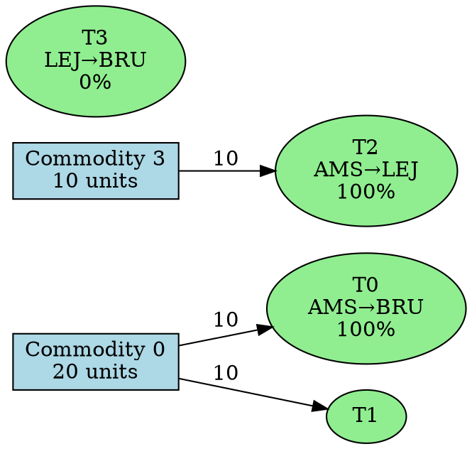
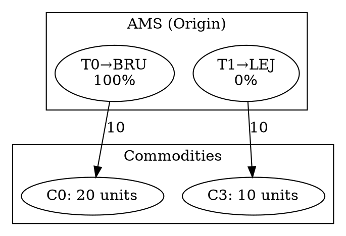

# MCNF Demo UI Enhancement Plan - Phase 5+

## Overview

Enhance the MCNF Demo UI to provide interactive, multi-perspective visualization of network solutions. Enable users to understand and explore solution details from both commodity and transport viewpoints with tabular and graph representations.

---

## Goals

1. **Commodity Perspective** - View which transports each commodity uses and understand its routing paths
2. **Transport Perspective** - View which commodities are assigned to each transport and capacity utilization
3. **Tabular View** - Structured data display with filtering and focus capabilities
4. **Graph View** - Visual network representation with dot/GraphViz rendering
5. **Interactivity** - Focus mode for individual items to highlight relevant connections

---

## Architecture Overview

```
┌─────────────────────────────────────────┐
│         Solution Analysis UI            │
├─────────────────────────────────────────┤
│  View Toggle: [Tabular] [Graph]         │
│  Perspective: [Commodity] [Transport]   │
├─────────────────────────────────────────┤
│                                         │
│  ┌─────────────────────────────────┐   │
│  │   Commodity Perspective         │   │
│  │  - List/Focus View              │   │
│  │  - Graph: Commodity ↔ Transport │   │
│  └─────────────────────────────────┘   │
│                                         │
│  ┌─────────────────────────────────┐   │
│  │   Transport Perspective         │   │
│  │  - List/Focus View              │   │
│  │  - Graph: Transport ↔ Commodity │   │
│  └─────────────────────────────────┘   │
│                                         │
└─────────────────────────────────────────┘
```

---

## Phase 5A: Enhanced Data Structures

### New Types in `serialization.rs`

```rust
// Commodity-centric view
#[derive(Serialize, Deserialize, Clone, Debug)]
pub struct CommodityDetail {
    pub commodity_id: usize,
    pub total_flow: u64,
    pub paths: Vec<CommodityPath>,
    pub transport_ids: Vec<usize>,  // All transports used
    pub origin_space: String,
    pub destination_space: String,
}

// Transport-centric view
#[derive(Serialize, Deserialize, Clone, Debug)]
pub struct TransportDetail {
    pub transport_id: usize,
    pub capacity: u64,
    pub utilized_capacity: u64,
    pub utilization_rate: f64,  // utilized / capacity
    pub assigned_commodities: Vec<CommodityAssignment>,
    pub origin_space: String,
    pub destination_space: String,
    pub departure_time: i64,
    pub arrival_time: i64,
}

// Single commodity's flow on a transport
#[derive(Serialize, Deserialize, Clone, Debug)]
pub struct CommodityAssignment {
    pub commodity_id: usize,
    pub assigned_flow: u64,
    pub num_paths: usize,
}

// Enhanced solution data with both perspectives
#[derive(Serialize, Deserialize, Clone, Debug)]
pub struct EnhancedSolutionData {
    pub total_flow_routed: u64,
    pub commodity_details: Vec<CommodityDetail>,
    pub transport_details: Vec<TransportDetail>,
}
```

### Updates to `McnfResponse`

Replace `solution_data: Option<SolutionData>` with:
```rust
pub enhanced_solution_data: Option<EnhancedSolutionData>,
```

---

## Phase 5B: Backend Extraction Logic

### New Functions in `solver_handler.rs`

```rust
/// Extract commodity-centric view
fn extract_commodity_details<V: Variant>(
    problem: &Problem<V>,
    solution: &McnfSolution<V>,
) -> Vec<CommodityDetail>

/// Extract transport-centric view
fn extract_transport_details<V: Variant>(
    problem: &Problem<V>,
    solution: &McnfSolution<V>,
) -> Vec<TransportDetail>

/// Build enhanced solution data combining both views
fn extract_enhanced_solution_data<V: Variant>(
    problem: &Problem<V>,
    solution: &McnfSolution<V>,
) -> EnhancedSolutionData
```

### Key Logic

**Commodity Details:**
- Extract all transport IDs used by the commodity
- Collect origin/destination spaces from commodity definition
- Group paths by transport
- Calculate total flow

**Transport Details:**
- Sum all commodity flows assigned to transport
- Calculate utilization rate: (total_flow / capacity)
- List all commodities with their assigned flows
- Extract transport origin/destination/times from network

---

## Phase 5C: Frontend Tabular Views

### Component Structure

```
┌─────────────────────────────────────────┐
│   CommodityPerspectiveView              │
├─────────────────────────────────────────┤
│  [Focus Mode Toggle]  [All Items]       │
├─────────────────────────────────────────┤
│ Commodity ID │ Origin │ Dest │ Flow     │
├─────────────────────────────────────────┤
│ 0 (focused)  │ AMS    │ BRU  │ 20/100  │
│   └─ Path 1: Transports 0,1             │
│   └─ Path 2: Transports 2               │
│                                         │
│ 1            │ AMS    │ CVG  │ 0/100   │
│ 2            │ AMS    │ LEJ  │ 0/100   │
└─────────────────────────────────────────┘
```

### Commodity Tabular View Features

1. **List Display**
   - Commodity ID, origin, destination, flow info
   - Expandable rows showing paths under each commodity
   - Each path shows: path index, flow amount, transport indices

2. **Focus Mode**
   - Select one commodity to highlight
   - Shows detailed path breakdown for that commodity
   - Highlights which transports are used
   - Shows capacity utilization of those transports

3. **Styling**
   - Color-code utilization rates (green=high, red=low)
   - Highlight focused commodity
   - Visual connection indicators (→)

---

## Phase 5D: Frontend Transport Perspective

```
┌──────────────────────────────────────────┐
│   TransportPerspectiveView               │
├──────────────────────────────────────────┤
│  [Focus Mode Toggle]  [All Items]        │
├──────────────────────────────────────────┤
│ Transport │ Route │ Capacity │ Used │ %  │
├──────────────────────────────────────────┤
│ 0 (focus) │ AMS→BRU│ 10     │ 10  │100% │
│   └─ Commodity 0: 10 units               │
│                                          │
│ 1         │ AMS→BRU│ 10     │ 0   │ 0%  │
│ 2         │ AMS→LEJ│ 10     │ 10  │100% │
│   └─ Commodity 3: 10 units               │
└──────────────────────────────────────────┘
```

### Transport Tabular View Features

1. **List Display**
   - Transport ID, origin→destination route
   - Capacity info, utilized capacity, utilization %
   - Expandable rows showing assigned commodities

2. **Focus Mode**
   - Select one transport to highlight
   - Shows all commodities using this transport
   - For each commodity: flow amount, paths that use this transport
   - Visual capacity bar showing utilization

3. **Styling**
   - Capacity utilization bar (visual indicator)
   - Color-coded percentage (green=100%, red=0%)
   - Highlight focused transport

---

## Phase 5E: Graph Visualization (Dot/GraphViz)

### Technology Choice: Graphviz (Dot Format)

**Why Dot:**
- Simple text format for specifying graphs
- Excellent layout algorithms (hierarchical, spring)
- Widely supported visualization libraries
- Can render both commodity and transport networks

**Rendering Options:**
1. **Server-side**: Generate PNG/SVG at backend, send to frontend
2. **Client-side**: Generate dot string, use web-based renderer (e.g., Viz.js)

**Recommendation**: Client-side with Viz.js for interactivity

### Commodity Network Graph

```
Nodes:
- Commodity nodes (C0, C1, C2, ...)
- Transport nodes (T0, T1, T2, ...)

Edges:
- Commodity → Transport (labeled with flow amount)
- Transport → Commodity (bidirectional view)

Layout: Bipartite/hierarchical
```

**Dot Template (Commodity View):**


### Transport Network Graph

```
Nodes:
- Transport nodes (T0, T1, T2, ...)
- Commodity nodes (C0, C1, C2, ...)

Edges:
- Transport → Commodity (flow amount)
- Commodity → Transport (bidirectional)

Layout: Hierarchical by time/space
```

**Dot Template (Transport View):**


---

## Phase 5F: Frontend Graph Component

### Graph View Component Structure

```typescript
<GraphView>
  <PerspectiveToggle 
    value={perspective}  // "commodity" | "transport"
    onChange={setPerspective}
  />
  <FocusSelector
    perspective={perspective}
    items={commodities | transports}
    focused={focusedId}
    onFocus={setFocusedId}
  />
  <DotVisualization
    dot={generatedDotString}
    highlightNodes={[focusedId]}
  />
</GraphView>
```

### Implementation Strategy

1. **Generate Dot String** (in solver_handler or frontend)
   - Use solution data to build dot representation
   - Mark focused items with special styling
   - Use colors to indicate utilization rates

2. **Render with Viz.js** (client-side)
   ```javascript
   const viz = new Viz();
   const svgString = viz.renderString(dotString);
   // Embed SVG in React component
   ```

3. **Interactive Features**
   - Hover over nodes/edges to show details
   - Click to change focus
   - Zoom and pan capabilities
   - Highlight connected nodes when focused

---

## Phase 5G: Integration & UI Layout

### New Component Structure

```
App
├── StatsPanel (existing)
├── SolutionViewSelector
│   ├── Tabular Tab
│   │   ├── CommodityPerspectiveTabular
│   │   └── TransportPerspectiveTabular
│   └── Graph Tab
│       ├── CommodityPerspectiveGraph
│       └── TransportPerspectiveGraph
```

### UI Layout

```
┌──────────────────────────────────────────┐
│         MCNF Network Solver               │
├──────────────────────────────────────────┤
│ [Objective Value] [Status] [Stats]       │
├──────────────────────────────────────────┤
│ View: [Tabular] [Graph]                  │
│ Perspective: [Commodity] [Transport]     │
├──────────────────────────────────────────┤
│                                          │
│  [Tabular/Graph View Content]            │
│                                          │
│  With Focus Selector:                    │
│  Focus on: [Dropdown] [Clear]            │
│                                          │
└──────────────────────────────────────────┘
```

---

## Implementation Roadmap

### Phase 5A: Backend Data Structures (Priority: HIGH)
- [ ] Add new types to `serialization.rs`
- [ ] Update `McnfResponse` structure
- [ ] Test serialization

### Phase 5B: Backend Extraction (Priority: HIGH)
- [ ] Implement `extract_commodity_details()`
- [ ] Implement `extract_transport_details()`
- [ ] Implement `extract_enhanced_solution_data()`
- [ ] Integrate into solve_network() function
- [ ] Test with demo problem

### Phase 5C: Commodity Tabular View (Priority: HIGH)
- [ ] Create `CommodityTableView` component
- [ ] Implement focus selector
- [ ] Add styling and colors
- [ ] Test interactivity

### Phase 5D: Transport Tabular View (Priority: MEDIUM)
- [ ] Create `TransportTableView` component
- [ ] Implement focus selector
- [ ] Add capacity utilization bar
- [ ] Add color coding

### Phase 5E: Dot Generation (Priority: MEDIUM)
- [ ] Create `generate_commodity_dot()` function
- [ ] Create `generate_transport_dot()` function
- [ ] Test dot output

### Phase 5F: Graph Visualization (Priority: MEDIUM)
- [ ] Integrate Viz.js library
- [ ] Create `GraphView` component
- [ ] Implement SVG rendering
- [ ] Add interactivity (hover, focus, zoom)

### Phase 5G: Integration & Polish (Priority: LOW)
- [ ] Update `StatsPanel` layout
- [ ] Add view/perspective toggles
- [ ] Add styling and responsive design
- [ ] Test on different screen sizes

---

## Technical Decisions

### Data Flow

```
McnfSolution (backend)
    ↓
extract_enhanced_solution_data()
    ↓
EnhancedSolutionData (JSON)
    ↓
Frontend components
    ├── Tabular: Extract and render tables
    └── Graph: Generate dot strings → Viz.js → SVG
```

### Graph Rendering Options

| Option | Pros | Cons |
|--------|------|------|
| **Viz.js (Client)** | Interactive, no server overhead, instant updates | More JS, initial load larger |
| **Graphviz Server** | Proven, high-quality output | Server dependency, slower, network overhead |
| **D3.js** | Ultimate flexibility, interactivity | Steep learning curve, more code |

**Recommendation**: Start with Viz.js for quick implementation, can switch to server-side if needed.

---

## UI/UX Considerations

### Accessibility
- [ ] Keyboard navigation for focus selection
- [ ] Screen reader support for graph descriptions
- [ ] Color-blind friendly palette

### Performance
- [ ] Lazy load graph generation
- [ ] Memoize dot string generation
- [ ] Debounce focus selection
- [ ] Handle large solutions (100+ commodities/transports)

### Visual Design
- [ ] Consistent color scheme (utilization % → color)
- [ ] Clear visual hierarchy (focused items prominent)
- [ ] Readable labels and legends
- [ ] Responsive layout for mobile/tablet

---

## Success Criteria

- [ ] Users can view commodity-centric solution breakdown
- [ ] Users can view transport-centric solution breakdown
- [ ] Tabular view shows all relevant data clearly
- [ ] Graph visualization renders correctly for demo data
- [ ] Focus mode highlights relevant connections
- [ ] Switching perspectives/views is responsive
- [ ] No performance issues with 5-10 commodities/transports
- [ ] UI is intuitive and self-explanatory

---

## Future Enhancements (Phase 6+)

- [ ] Export graphs as PNG/PDF
- [ ] Advanced filtering (by space, time, flow range)
- [ ] Path animation (animate flow along routes)
- [ ] Cost analysis view
- [ ] Time-space graph representation
- [ ] Comparison of alternative solutions
- [ ] Sensitivity analysis visualization

---

## Notes

- **Visualization Library**: Recommend starting with Viz.js for quick POC, can migrate to server-side Graphviz if performance becomes issue
- **Data Enrichment**: Phase 5B adds significant data to response; consider pagination for very large solutions
- **Interactive Focus**: Focus mode should be the primary interaction pattern for both perspectives
- **Graph Complexity**: Start with simple bipartite graphs, can add more sophisticated layouts later

